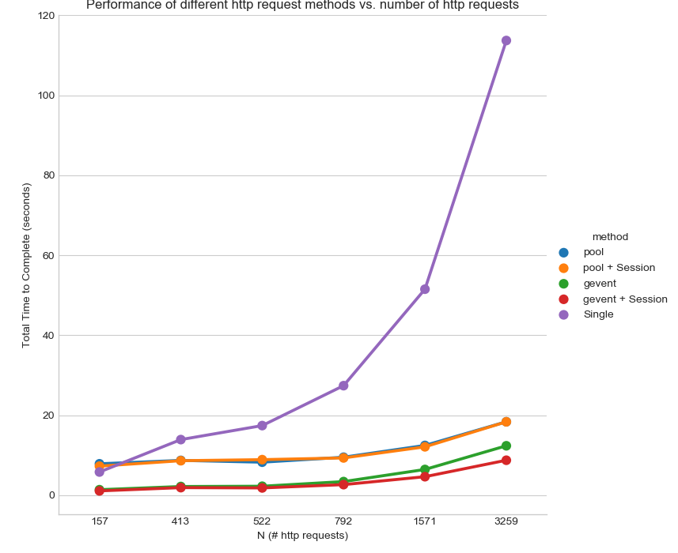

使用Python多线程爬虫获取B站UP主视频信息


# 目标

使用Python获取指定B站UP主所有上传视频

使用Python自带或第三方多任务插件进行加速

# 需要的库

```Python
import requests
import psutil
import sys
import os
from bs4 import BeautifulSoup
import multiprocessing
from multiprocessing import cpu_count
import matplotlib.pyplot as plt
import seaborn as sns
import numpy as np
import time
from pandas import DataFrame
import gevent.monkey

import gevent.pool as gpool
```


# 基础例子(单线程)

```Python
# UP主id: 如https://space.bilibili.com/14781644中，14781644为mid
mid = 14781644

# API: 此API返回json格式，含有当前页面的所有上传视频信息
url = "https://space.bilibili.com/ajax/member/getSubmitVideos?mid=%s&pagesize=30&tid=0&page=%s&keyword=&order=pubdate" % (mid, page)

# 通过一次request该API，获取所有页数的url
API_list, itemNum = getListing(mid)

# 循环所有页面获得每个视频的信息
Info = []
for page in API_list:
	Info.append(get_singlePage(page))
```

其中

`getListing`含有一次`requests.get`

```Python
def get_pageList(mid, headers):
    ''' input: (bilibili) mid
        output: A list containing page urls for all submitted videos
    '''
    pageSize = 30
    API= ('https://space.bilibili.com/ajax/member/getSubmitVideos?mid=%s' % str(mid)
            + '&pagesize=%s' % str(pageSize) + '&tid=0&page=%s&keyword=&order=pubdate' )
    pageNum = 0
    itemNum = 0

    # get pageNum
    try:
        r = requests.get((API % '1'), headers=headers)
        if r.status_code == 200:
            json_content = r.json()
            tlist = json_content['data']['tlist']
            for tab in tlist:
                itemNum += int(tlist[tab]['count'])
            pageNum = int(itemNum/pageSize) + (itemNum % pageSize > 0)
    except Exception as e:
        print(e)
        sys.exit

    # get page list
    API_list = [(API % str(page)) for page in range(1, pageNum + 1)]
    return [API_list, itemNum]
```

`get_singlePage`含有一次`requests.get`, 返回`{"视频名字", "aid", "url"}`

```Python
def get_singlePage(params):

    page_url, headers = params

    try:
        r = requests.get(page_url, headers=headers)
        json_content = r.json()
        vlist = json_content['data']['vlist']
        records = []
        for video in vlist:
            records.append(json_video(video)) # json_video用于提取一个json object中的信息
    except Exception as e:
        print(e)
        sys.exit

    return records
```

执行结果

```
# 视频数量 花费时间
100 took 5.667012453079224 seconds
200 took 14.260912895202637 seconds
300 took 17.25295925140381 seconds
700 took 26.95353651046753 seconds
1500 took 51.36556887626648 seconds
3000 took 108.84225630760193 seconds
```

**在基础例子中，我们一共需要进行（视频数量/30）次requests。**因此，如果UP主所上传的视频数目过多，进行一次爬虫会花去数分钟时间，这对需要重复爬取的用户非常不利。


# 多任务

幸好，Python和其他第三方为我们提供了不少用于多任务计算的库：有Python自带的`multiprocessing`，有由`gevent`提供的`gevent.pool`，还有用于提供同一链接persistent link的`requests.session`功能。

以下，我将用以上提及的不同库对基础例子进行优化，并进行比较。

用于计算时间和作图的代码由[此博客](http://maxmelnick.com/2016/04/18/faster-python-data-scraping.html)提供。


首先，做好一个`simulateCrawlMember`方程用于使用不同的爬虫方程对多个拥有不同视频数量的用户进行爬取。

```Python
def simulateCrawlMember(my_func, method_name, headers):

    mid_bucket = [17221410, 2139573, 37694382, 26810901, 26480852, 1315101]

    times = []
    for mid in mid_bucket:
        [API_list, itemNum] = get_pageList(mid, headers)
        secs = my_func(API_list, 10, headers)[1]
        times.append({'method': method_name, 'N': itemNum, 'seconds': secs})

    return times
```


然后，借鉴[此博客](http://maxmelnick.com/2016/04/18/faster-python-data-scraping.html)的画图方程，用于比较不同爬虫方法的速度。

```Python
def plotPerformance(performance_results):
    df = DataFrame(performance_results)

    g = sns.factorplot(x='N', y='seconds', hue='method',
                   data=df, size=7, ci=None)

    g.set_axis_labels('N (# http requests)', 'Total Time to Complete (seconds)')
    plt.title('Performance of different http request methods vs. number of http requests')

```


接着，借鉴[此博客](http://maxmelnick.com/2016/04/18/faster-python-data-scraping.html)的计时方程，用于计算每一个爬虫方程的速度。

```PYthon
def timefunc(f):
    '''
    Time profiling function adapted from "Simple Timers" example at
    https://zapier.com/engineering/profiling-python-boss/
    '''
    def f_timer(*args, **kwargs):
        start = time.time()
        result = f(*args, **kwargs)
        end = time.time()
        elapsed_time = end - start
        print f.__name__, 'took', elapsed_time, 'seconds'
        return (result, elapsed_time)
    return f_timer
```


合起来，我们的测试方程像这样

```Python
sns.set_style('whitegrid')

performance_results = []
headers = {'user-agent': 'Mozilla/5.0 (Macintosh; Intel Mac OS X 10_11_6) AppleWebKit/537.36 (KHTML, like Gecko) Chrome/53.0.2785.143 Safari/537.36'}

performance_results += simulateCrawlMember(parseAll_gevent, 'gevent', headers)
plotPerformance(performance_results, 'gevent')

performance_results += simulateCrawlMember(parseAll_pool, 'pool', headers)
plotPerformance(performance_results, 'pool')

performance_results += simulateCrawlMember(parseAll_gevent_session, 'gevent + Session', headers)
plotPerformance(performance_results, 'gevent + Session')

performance_results += simulateCrawlMember(parseAll_pool_session, 'pool + Session', headers)
plotPerformance(performance_results, 'pool + Session')

performance_results += simulateCrawlMember(parseAll_single, 'Single', headers)
plotPerformance(performance_results,'Single' )
```

## 单程

```Python
@timefunc
def parseAll_single(API_list, numProcess, headers):
    # numProcess is dummy

    result = []
    for API_url in API_list:
        result.append(get_singlePage((API_url, headers)))
```

执行结果

```
parseAll_single took 5.729526519775391 seconds
parseAll_single took 14.209691286087036 seconds
parseAll_single took 17.519840240478516 seconds
parseAll_single took 27.10710334777832 seconds
parseAll_single took 52.06931471824646 seconds
parseAll_single took 110.40392351150513 seconds
```

## 使用multiprocessing库

`multiprocessing` 是python自带的多进程库。`multiprocessing`侧重多CPU分配，将任务分配给不同的CPU和进程用以提高处理效率。在本文的应用时，`multiprocessing`建立多个进程用以同时处理不同的`requests`访问要求。更多`multiprocessing`问题，请访问[Python文档](https://docs.python.org/3.6/library/multiprocessing.html) 。

```Python
@timefunc
def parseAll_pool(API_list, numProcess, headers):
    with multiprocessing.Pool(numProcess) as p:
        result = p.map(get_singlePage, zip(API_list, [headers] * len(API_list)))
```

> 在单个requests方程拥有多个输入量时，需使用iterable，可通过zip()实现

执行结果

```
parseAll_pool took 5.815796136856079 seconds
parseAll_pool took 9.356193780899048 seconds
parseAll_pool took 9.501183986663818 seconds
parseAll_pool took 9.569898843765259 seconds
parseAll_pool took 13.018352508544922 seconds
parseAll_pool took 18.32560443878174 seconds
```

## 使用multiprocessing + session库

`requests.session()`使用`urllib3`的connection pooling，让用户在访问同一网址时，可以使用统一的变量和cookie。同时，`requests.session()`让重复访问的`TCP`链接被重复利用，大幅提高访问速度。

在我们的例子中，我们虽然不会重复访问同一个网址，但这些网址处于同一个域名下，所以我想测试以下`session`是否仍然能够提供一定的加速。

```Python
@timefunc
def parseAll_pool_session(API_list, numProcess, headers):
    s = requests.session()
    s.headers.update(headers)
    with multiprocessing.Pool(numProcess) as p:
        result = p.map(get_singlePage_session, zip(API_list, [s] * len(API_list)))

    s.close()
```

执行结果

```
parseAll_pool_session took 5.774076223373413 seconds
parseAll_pool_session took 9.44986343383789 seconds
parseAll_pool_session took 8.862924575805664 seconds
parseAll_pool_session took 10.02916932106018 seconds
parseAll_pool_session took 12.375799655914307 seconds
parseAll_pool_session took 18.021499633789062 seconds
```

## 使用gevent库

> gevent is a [coroutine](https://en.wikipedia.org/wiki/Coroutine) -based [Python](http://python.org/) networking library that uses [greenlet](https://greenlet.readthedocs.io/) to provide a high-level synchronous API on top of the libev event loop. - Documentation

`gevent`是一个第三方**协程**资源库，可通过`pip install gevent`进行安装。协程不等于进程，协程不拥有独立独立的内存空间，占有资源小。协程共享堆，不共享栈，由程序员在协程的代码里显示调度；同时，多采用异步的消息通讯，效率比较高。更多进程和协程信息，请访问[这篇博文](https://www.jianshu.com/p/c6053a4c3dd5)。

```Python
@timefunc
def parseAll_gevent(API_list, numProcess, headers):
    gevent.monkey.patch_socket()
    pool = gpool.Pool(numProcess)

    for i in range(len(API_list)):
        pool.spawn(get_singlePage, (API_list[i], headers))

    pool.join()
```

> 每个线程（进程）循环按照指定的任务清单顺序完成不同的任务（当任务被堵塞时，执行下一个任务；当恢复时，再回来执行这个任务；任务间切换只需要保存任务的上下文，没有内核的开销，可以不加锁的访问全局变量）

```
parseAll_gevent took 5.389847040176392 seconds
parseAll_gevent took 12.893646955490112 seconds
parseAll_gevent took 16.130355834960938 seconds
parseAll_gevent took 25.19377088546753 seconds
parseAll_gevent took 50.55870485305786 seconds
parseAll_gevent took 107.25761365890503 seconds
```


## 使用gevent库 + session库

```Python
@timefunc
def parseAll_gevent_session(API_list, numProcess, headers):
    gevent.monkey.patch_socket()
    pool = gpool.Pool(numProcess)

    s = requests.session()
    s.headers.update(headers)

    for i in range(len(API_list)):
        pool.spawn(get_singlePage_session, (API_list[i], s))

    pool.join()

    s.close()
```

```
parse_gevent took 1.3498566150665283 seconds
parse_gevent took 2.1473851203918457 seconds
parse_gevent took 2.217400550842285 seconds
parse_gevent took 3.378615617752075 seconds
parse_gevent took 6.412792682647705 seconds
parse_gevent took 12.337404251098633 seconds
```


需要注意的是，使用`gevent`需要先进行`monkey.patch_all()`。

gevent和python自带的socket库有部分的兼容问题，因此gevent提供了自己的socket补丁`monkey.patch_all()`。需要在import之后立刻进行。

```
import gevent.pool as pool
import gevent.monkey

monkey.patch_all()
```


> 在进行monkey.patch_all()之后，multiprocessing()等使用默认socket库的程序会出现错误。有一些错误可以通过`monkey.patch_all(thread=False, socket=False)`解决，有一些不行。因此，尽量把gevent的使用放在代码末尾，或者避免和multiprocessing等同时使用。gevent自带的threading功能足够满足多线程需求。


如果未进行monkey补丁，在同时使用`gevent`和`requests.session`则可能出现以下错误。该错误为多次重复服务器拒绝连接，是由`gevent`和默认`socket`冲突导致。。

```Bash
HTTPSConnectionPool(host='space.bilibili.com', port=443): Max retries exceeded with url: /ajax/member/getSubmitVideos?mid=1315101&pagesize=30&tid=0&page=2&keyword=&order=pubdate (Caused by SSLError(SSLError("bad handshake: SysCallError(-1, 'Unexpected EOF')",),))
Traceback (most recent call last):
  File "C:\Users\Dongxu\AppData\Local\Programs\Python\Python36\lib\site-packages\gevent\greenlet.py", line 536, in run
    result = self._run(*self.args, **self.kwargs)
  File "C:\Users\Dongxu\Documents\getVideo_biliMember.py", line 106, in get_singlePage_session
    return records
UnboundLocalError: local variable 'records' referenced before assignment
Mon Mar  5 04:08:28 2018 <Greenlet at 0x20162abe470: get_singlePage_session(('https://space.bilibili.com/ajax/member/getSubmit)> failed with UnboundLocalError
```


## 使用grequests库(有误)

`grequests`是由[kennethreitz](https://github.com/kennethreitz)开发的第三方库。grequests同时使用requests和gevent，允许用户发起多个异步HTTP请求。`grequests`简化了单独使用`gevent`的步骤，并且在进行HTTP请求时有一定速度上的提升。

```Python
def exception_handler(request, exception):
    print("Request failed")

@timefunc
def parseAll_grequests(API_List, numProcess, headers):
    import grequests

    s = requests.Session()

    rs = (grequests.get(u, session=s) for u in API_List)
    responses = grequests.map(rs, exception_handler=exception_handler)
    all_records = []

    for r in responses:
        if r:
            if r.status_code == 200:
                json_content = r.json()
                vlist = json_content['data']['vlist']
                records = []
                for video in vlist:
                    records.append(json_video(video))
                all_records += records
            else:
                print(r.status_code)
```

执行结果

```
parse_gevent_session took 1.0508449077606201 seconds
parse_gevent_session took 1.8688721656799316 seconds
parse_gevent_session took 1.7941479682922363 seconds
parse_gevent_session took 2.61824893951416 seconds
parse_gevent_session took 4.60194730758667 seconds
parse_gevent_session took 8.719105005264282 seconds
```

使用`grequests`依然会导致response错误，无论是否使用`session`。所以，`gevent`应该共享了一些HTTP链接数据导致B站将不同的requests视作爬虫处理。

>  关于更多的grequests: [thread](https://stackoverflow.com/questions/23935201/is-a-python-requests-session-object-shared-between-gevent-greenlets-thread-safe), [doc](https://github.com/kennethreitz/grequests)


# 结果分析




>  其中，N为UP主视频数量，实际执行的`requests.get`访问数大概为N/30。


| 视频数 | 单线程 | pool  | pool + session | gevent | gevent + session |
| ------ | :----: | :---: | :------------: | :----: | :--------------: |
| 156    | 5.773  | 7.83  |     7.241      | 1.349  |       1.05       |
| 413    | 13.88  | 8.68  |      8.60      | 2.147  |       1.86       |
| 522    | 17.38  | 8.231 |      8.86      | 2.217  |       1.79       |
| 792    | 27.37  | 9.473 |      9.29      | 3.378  |      2.618       |
| 1569   | 51.51  | 12.42 |     12.07      | 6.412  |       4.60       |
| 3259   | 113.71 | 18.34 |     18.33      | 12.33  |       8.71       |

## gevent速度最快

在仅仅使用10个gevent携程时，`gevent`所达到的速度也比`multiprocessing`快上一倍左右。由此可以看出，在进行大量socket连接时，`gevent`这个针对网络连接优化过的多“线程”库比多进程更加高效。而在资源占用率上，`gevent`因为不产生新的进程，对于机器基本不产生额外的负担。在我的台式机上，可以轻易的使用上百条携程。

## multiprocessing优化明显，但资源占用率太大

`multiprocessing.pool`对于我们的应用的加速也很明显。共享`session`的使用在使用`multiprocessing`时并没有明显的加速。然而，使用`multiprocessing`时CPU占用率达到了100%，对于需要计算机同时处理其它工作显然时不合适的。可以考虑减少进程数，或者使用`psutils`来限制进程的优先度。

```Python
import psutil
from multiprocessing import Pool, cpu_count

def limit_cpu():
    "is called at every process start"
    p = psutil.Process(os.getpid())
    # set to lowest priority, this is windows only, on Unix use ps.nice(19)
    p.nice(psutil.BELOW_NORMAL_PRIORITY_CLASS)

# 使用pool时
pool = Pool(None, limit_cpu) # 使用CPU核心数目，也可以自定义

```

执行结果

|          | psutil | 2 Process | 4 Process | 10 Process | 单线程 |
| :------: | :----: | :-------: | :-------: | :--------: | :----: |
| 3259视频 | 31.91  |   60.75   |   32.19   |   18.32    | 110.41 |
|   CPU    |  浮动  |  小于50%  |   浮动    |    100%    |  <10%  |

## requests.session优化作用不明显

无论在使用`gevent`还是`multiprocessing`时，加上`requests.session`后的优化都不明显。原因可能是因为我们的并没有重复连接同一url。不过在访问大量连接时，`session`对于`gevent`有小程度的优化。可以预则，如果继续加大需要访问的连接量，`session`加速会更加明显。


#参考

[Faster Python Data Scraping with gevent.pool](http://maxmelnick.com/2016/04/18/faster-python-data-scraping.html)

[How to speed up your python web scraper by using multiprocessing](http://blog.adnansiddiqi.me/how-to-speed-up-your-python-web-scraper-by-using-multiprocessing/)

[Limit total CPU usage in python multiprocessing](https://stackoverflow.com/questions/42103367/limit-total-cpu-usage-in-python-multiprocessing)

[Is a Python requests Session object shared between gevent greenlets, thread-safe (between greenlets)?](https://stackoverflow.com/questions/23935201/is-a-python-requests-session-object-shared-between-gevent-greenlets-thread-safe)

[Python gevent: pass multiple arguments to function called via pool.map](https://stackoverflow.com/questions/13490346/python-gevent-pass-multiple-arguments-to-function-called-via-pool-map)

[Gevent 进程 线程 协程 异步](https://www.jianshu.com/p/c6053a4c3dd5)

[gevent-pool](http://www.gevent.org/gevent.pool.html)

[Gevent monkeypatching breaking multiprocessing](https://stackoverflow.com/questions/8678307/gevent-monkeypatching-breaking-multiprocessing)